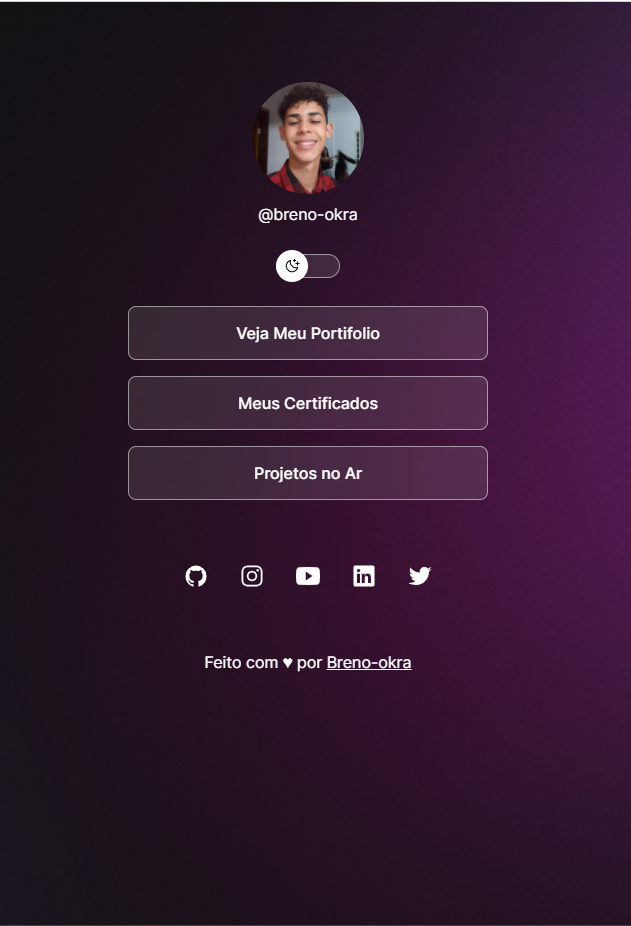
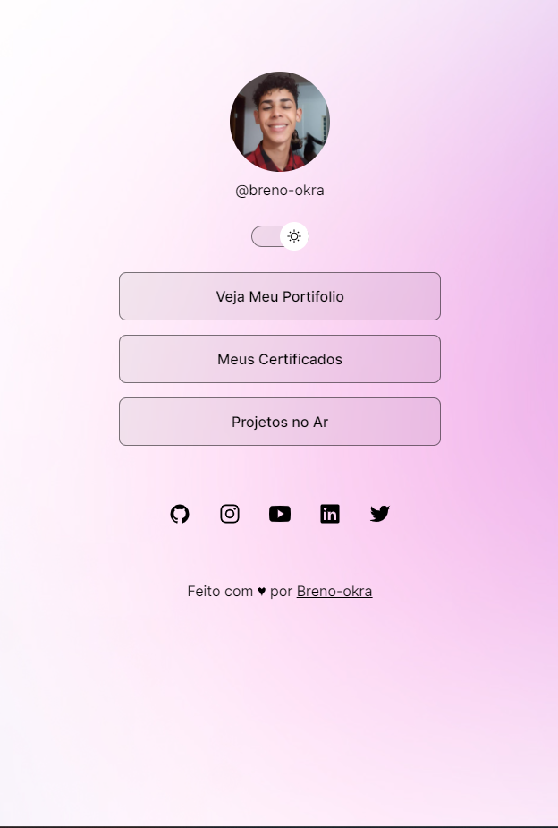

<h1 align="center">Somente Um Projeto Simples 
</h1>

## 🚀 Tecnologias

Esse projeto foi desenvolvido com as seguintes tecnologias:

- HTML
- CSS
- JavaScript

## PRINCIPAL APRENDIZADO
ultilizar variaveis no css a modo de alternar cores e imagens em toda interface

## sobre
projeto desenvolvido no discover da rocketseat

## 💻 Projeto Fotos

 
 

